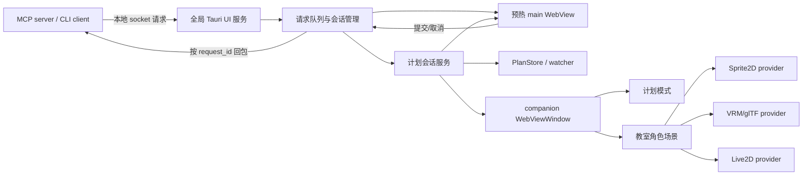

# Tauri 预热、计划面板与桌宠系统技术规范

> 状态：待用户最终确认，尚未进入实现
>
> 适用仓库：`sanshu`
>
> 需求入口：`src/frontend/components/popup/PlanPanel.vue`
>
> 形成日期：2026-07-12

## 1. 结论摘要

本项目不把计划弹窗迁移到 Rust 原生 UI。保留 Vue/Tauri WebView，并把性能问题从“每次创建新 GUI 进程”改为“全局托盘单实例 + 隐藏 WebView 预热 + 本地 IPC 请求复用”。

原因如下：

1. 当前冷启动开销主要来自 `create_tauri_popup` 每次执行 `Command::new(...).output()` 创建并等待一个新 UI 进程，而不是 `PlanPanel.vue` 的列表绘制。
2. 计划面板已经依赖 Vue 状态、Tauri 事件与 Rust plan watcher。迁移原生 UI 会增加第二套组件、主题、事件、无障碍与生命周期实现。
3. 后续桌宠需要透明窗口、Canvas/WebGL、VRM、Live2D 与动态资源加载。WebView 的 Three.js、VRM、Canvas 生态更适合；Rust 原生 UI 仍需额外接入 3D/Live2D 渲染栈。
4. 一个 Tauri 进程可以同时管理预热的 zhi 主窗口与独立桌宠窗口，无需为桌宠保留“每次新开”的旧模式。

最终产品包含两种桌面展示模式：

- **计划模式**：未选择角色时，右下角置顶显示完整计划面板、完成度、完成图标、删除线、单项耗时与短句。
- **角色场景模式**：选择角色后，右下角置顶显示小教室舞台。黑板实时展示完整计划，角色在计划完成时跑到对应条目执行书写/划线动作，再返回待机位置。

本阶段最终交付 4 个可热切换 VRM 角色，并同时提供 Sprite2D、VRM/glTF、Live2D Cubism 三种模型 provider。Live2D provider 源码开源，但专有 Cubism Core 不进入仓库，必须由用户在接受官方条款后本地导入。

## 2. 现状证据

| 位置 | 当前行为 | 影响 |
| --- | --- | --- |
| `src/rust/mcp/handlers/popup.rs` | 每个请求写临时 JSON，再启动 `等一下 --mcp-request`，通过子进程 stdout 等待结果 | 每次请求都承担进程与 WebView 冷启动成本 |
| `src/rust/mcp/handlers/ui_launcher.rs` | 仅查找并探测 UI 可执行文件 | 无预热、单实例或 IPC 复用 |
| `src/rust/app/cli.rs` | `--mcp-request`、`--cli` 都启动 Tauri GUI | CLI/MCP 协议与 GUI 进程生命周期耦合 |
| `src/frontend/composables/useMcpHandler.ts` | 收到请求后显示弹窗，提交后调用 `exit_app` | 无法复用已加载的前端 |
| `src/rust/mcp/tools/plan/commands.rs` | `PlanWatchState` 只有一个活动 watcher | 适合单前台 workspace，不支持组件各自抢占 watcher |
| `src/frontend/components/popup/PlanPanel.vue` | 组件自行启动/停止 watcher 与监听 `plan-updated` | 长驻窗口与多视图复用前需集中计划会话所有权 |
| `tauri.conf.json` | 单个可见 `main` 窗口 | 尚无隐藏预热、托盘服务或桌宠窗口 |
| `Cargo.toml` | 已启用 Tauri `tray-icon` feature，但没有托盘业务实现 | 可复用现有 Tauri 能力，无需替换 GUI 框架 |

## 3. 目标与非目标

### 3.1 目标

- zhi 请求到预热窗口可见目标不超过 300ms，可交互目标不超过 500ms。
- 全局只运行一个 UI 服务，多个 MCP server、IDE 与 CLI 客户端共享。
- 保持现有 zhi/CLI 响应语义，请求结果必须回到原调用方。
- 关闭主窗口只隐藏，托盘提供显示、暂停桌宠与完全退出。
- 计划列表在 zhi 与桌宠中复用同一数据流，不互相拥有生命周期。
- 支持安全安装、卸载、切换 `.petpack`，切换模型不重启 UI。
- 支持 Sprite2D、VRM/glTF 与可选 Cubism Core 的 Live2D 模型。
- Windows、macOS、Linux 同期提供核心功能；Linux 验证 X11 与 Wayland。
- 模型管理与日常操作对点击困难用户友好，可使用托盘、快捷键和键盘完成。

### 3.2 非目标

- 不用 Rust 原生 UI 重写 `PlanPanel.vue`。
- 不允许模型包执行 JS、WASM、动态库、安装脚本或任意命令。
- 不在应用运行时集成 Meshy 模型生成；Meshy 只用于开发期资产制作工具。
- 不把 Cubism Core、来源不明模型或不允许再分发的模型提交到 GitHub。
- 不实现透明像素级选择性穿透承诺。首版使用“整窗交互/整窗穿透”显式模式。
- 不让完成动画阻塞 plan MCP 状态提交；动画只表现已经落盘的真实状态。

## 4. 方案对比

| 方案 | 优点 | 缺点 | 结论 |
| --- | --- | --- | --- |
| Tauri 单实例 + WebView 预热 | 复用 Vue/PlanPanel；最适合 Three.js、VRM、Live2D；KISS/SOLID 最佳 | 需要常驻 WebView 内存与 IPC | **采用** |
| egui/eframe 原生计划窗 | Rust 集成直接、即时模式适合工具面板 | 非系统原生控件；需要复制 UI/主题/无障碍；3D 需另接渲染 | 不采用 |
| iced 原生计划窗 | Elm 风格状态模型清晰，支持 Canvas 与多窗口 | 新增第二套状态/UI 栈；无法复用 Vue 组件 | 不采用 |
| Slint 原生计划窗 | 声明式、跨平台、适合嵌入式与桌面 | 新增 UI 语言与构建链；VRM/Live2D 仍需独立渲染集成 | 不采用 |
| 临时文件轮询预热 | 接近现有代码 | 残留、竞态、取消与回包复杂，延迟不可控 | 不采用 |
| localhost TCP | 易调试 | 端口、token、网络栈与防火墙面增加 | 备选 |
| OS 本地 socket | Windows named pipe、Unix domain socket，跨平台且不经过网络 | 需定义消息帧与服务生命周期 | **采用** |

## 5. 总体架构



### 5.1 进程

- `三术` MCP server 保持独立进程。
- `等一下 --ui-service` 是全局、每用户单实例的 Tauri UI 服务。
- MCP server 启动时异步探测 UI socket；服务不存在时启动并预热，不阻塞 MCP server 的其他工具注册。
- 手动运行 `等一下` 时连接或聚焦同一个 UI 服务。
- CLI bridge 连接 UI 服务、等待对应响应并把原结构写到自己的 stdout，保持外部协议兼容。
- 旧 `--mcp-request` 路径保留一个版本作为回退，稳定后移除。

### 5.2 窗口

| label | 职责 | 默认状态 |
| --- | --- | --- |
| `main` | zhi 交互、设置、现有 PlanPanel | 启动时隐藏并预热；请求到达后显示 |
| `companion` | 计划模式或教室角色场景 | 用户启用后显示；独立关闭只隐藏 |

- `main` 提交后不退出进程，只清理当前请求并隐藏或展示下一请求。
- `companion` 不抢输入焦点；交互模式下可拖动/点击，穿透模式下整窗忽略鼠标。
- 托盘菜单：显示 zhi、显示/隐藏桌宠、暂停动画、交互/穿透切换、模型选择、最近 workspace、设置、完全退出。
- 默认不随系统登录启动；设置中可选启用自动启动。

## 6. IPC 协议

### 6.1 传输

- 使用 Rust `interprocess` 的 Tokio local socket。
- Windows 使用 named pipe；macOS/Linux 使用 Unix domain socket 或受支持的 namespaced socket。
- Unix 文件型 socket 权限限制为当前用户；Windows 使用当前用户命名空间，并增加随机服务 token 握手。
- token 位于用户配置目录，权限尽可能收紧；不进入日志、错误正文或前端状态。

### 6.2 帧格式

- 4 字节大端无符号长度 + UTF-8 JSON。
- 单帧最大 2 MiB，超限立即拒绝。
- 所有消息包含 `protocol_version` 与 `request_id`。

请求字段：

```json
{
  "protocol_version": 1,
  "request_id": "uuid",
  "client_id": "uuid",
  "kind": "zhi",
  "workspace": "absolute-path-or-null",
  "deadline_ms": 1800000,
  "payload": {}
}
```

响应字段：

```json
{
  "protocol_version": 1,
  "request_id": "uuid",
  "status": "completed",
  "payload": {},
  "error": null
}
```

终态必须是 `completed`、`cancelled`、`client_disconnected`、`ui_service_shutdown`、`timeout` 或 `failed` 之一。

### 6.3 队列语义

- 全局一个活动 zhi 主窗口，其余请求 FIFO。
- 托盘和主窗口显示待处理数量。
- 每个请求保留自己的 `client_id`、workspace 与连接，不允许串包。
- 尚未展示的请求在调用方断开时自动取消。
- 已展示请求断开后进入只读错误态，不能继续提交。
- 不实现插队、覆盖或多 zhi 窗口并行。
- 未提供 deadline 时使用 30 分钟。
- UI 服务异常时客户端只尝试重启一次，失败返回明确错误。

## 7. 计划会话与耗时

### 7.1 watcher 所有权

- watcher 从 `PlanPanel.vue` 生命周期上移到 Rust `PlanSessionState`。
- 当前活动 zhi workspace 优先；无活动请求时 companion 保留最近一次有效 workspace。
- 托盘可在无活动请求时切换最近 workspace；活动 zhi 期间 companion 跟随活动请求，避免多 watcher 产品范围膨胀。
- 所有 `plan-updated` 事件携带 workspace，前端必须过滤。
- `PlanPanel.vue` 与 companion 只订阅 snapshot，不直接争抢 watcher。

### 7.2 Plan 文件升级

Plan 文件升级为版本 2，旧版本读取时补空字段，不破坏已有计划。

```json
{
  "version": 2,
  "workspace": "absolute-path",
  "created_at": "RFC3339 UTC",
  "items": [
    {
      "id": "task-id",
      "text": "任务文本",
      "status": "in_progress",
      "started_at": "RFC3339 UTC or null",
      "completed_at": null,
      "active_elapsed_ms": 12500
    }
  ]
}
```

计时规则：

- pending -> in_progress：首次写入 `started_at` 并开始当前计时段。
- 离开 in_progress：累计当前段到 `active_elapsed_ms`。
- 再次进入 in_progress：继续累计，不覆盖历史。
- completed：写入 `completed_at` 并固化累计值。
- 未进入 in_progress 直接 completed：耗时为未知，不显示 0。
- 所有写入由 Rust 使用 UTC 时间完成，采用原子文件替换。

## 8. 桌面展示

### 8.1 计划模式

- 默认右下角、置顶、约 420px 宽，高度不超过当前工作区 70%。
- 展示标题、完成数/总数、进度、计划文本、状态图标与耗时。
- completed 行显示完成图标和删除线；不能只依赖颜色表达状态。
- 超长文本换行，列表滚动，按钮与正文不得重叠。
- loading、空计划、读取错误、workspace 缺失与 plan MCP 关闭都有明确状态。

### 8.2 角色场景模式

- 约 720x420 逻辑像素，位于右下角；支持 75%、100%、125%、150% 缩放。
- 黑板约占左侧 68%，右侧与底部为角色动作通道，舞台外透明。
- 每页最多 8 条计划，自动跟随 in-progress 或刚完成条目，支持托盘/快捷键翻页。
- 黑板文本使用经过许可的开源中文手写字体；无字体时回退为高可读系统字体。
- 计划文字、图标、删除线与耗时由前端绘制，不烘焙进模型或背景图。
- 数据完成状态立即显示；角色跑动和书写动画是非阻塞装饰层。
- 隐藏/暂停/系统休眠时停止 RAF；恢复后直接同步最终计划状态，不补播过期长动画。

### 8.3 动作状态机

优先级从高到低：

1. renderer/model 错误；
2. 新完成项的 write/celebrate；
3. plan 状态切换；
4. 用户手动动作；
5. 随机彩蛋；
6. idle/sleep。

基础动作：

- `idle`
- `sleep`
- `ready`
- `working`
- `run`
- `write`
- `celebrate`
- `fall`
- `snack`
- `drink`
- `error`

随机动作有冷却时间，不连续触发，不打断完成动画。模型缺少动作时通过 manifest fallback 链回到 `idle`。

### 8.4 名句

- 仅内置可核验作者/出处的公版短句，或明确标识为“项目自拟”。
- 最长约 24 个中文字符；完成动画期间隐藏。
- 只在 idle/ready 时轮换，默认最短间隔 60 秒。
- 支持关闭、减少频率与选择仅项目自拟。
- 不在运行时抓取网络名句，不使用来源不明或可能误署名的内容。

## 9. 模型系统

### 9.1 provider

统一接口包含：

- `load(pack, signal)`
- `play(action, options)`
- `setPaused(paused)`
- `resize(viewport)`
- `getMetrics()`
- `dispose()`

实现：

- Sprite2D：Canvas/PixiJS 动作图集，作为低功耗与故障回退。
- VRM/glTF：Three.js + `@pixiv/three-vrm`；VRMA 使用 `@pixiv/three-vrm-animation`。
- Live2D：开源 provider 封装官方 Cubism SDK for Web 接口；Cubism Core 由用户本地导入。

3D 场景必须是 companion 的主画布，不放在装饰卡片内。模型切换先在隐藏 staging renderer 加载，成功后原子替换；失败保持旧模型。

### 9.2 `.petpack`

`.petpack` 是 ZIP 容器，根目录必须有 `manifest.json`：

```json
{
  "schema_version": 1,
  "id": "org.sanshu.pet.tech-assistant",
  "version": "1.0.0",
  "name": "青绿技术社团助教",
  "provider": "vrm",
  "entry": "model/assistant.vrm",
  "preview": "preview.webp",
  "license": {
    "spdx": "CC-BY-4.0",
    "author": "...",
    "source_url": "...",
    "text": "LICENSE.txt"
  },
  "integrity": {
    "model/assistant.vrm": "sha256-..."
  },
  "display": {
    "scale": 1.0,
    "ground_offset": [0, 0, 0]
  },
  "actions": {
    "idle": [{ "clip": "animations/idle.vrma", "loop": true }],
    "run": [{ "clip": "animations/run.vrma", "loop": true }],
    "write": [{ "clip": "animations/write.vrma", "loop": false }]
  },
  "fallbacks": {
    "snack": ["idle"],
    "drink": ["idle"]
  }
}
```

### 9.3 安装与热切换

1. 设置页选择 `.petpack` 或解压目录。
2. Rust 在临时 staging 目录校验。
3. 校验通过后原子移动到应用数据目录。
4. 更新模型索引并通知 companion。
5. 用户切换模型时先加载新模型，成功后释放旧资源。
6. 卸载当前模型前先切换到内置 Sprite2D 回退。
7. 安装失败不改变当前模型与配置。

安全限制：

- 禁止绝对路径、`..`、符号链接与重复规范化路径。
- 只允许 manifest 声明的资源扩展名。
- 默认最大 250 MiB 压缩、750 MiB 解压、4096 个文件，并限制解压比。
- 所有文件 SHA-256 必须匹配。
- 不加载 JS、WASM、DLL、SO、dylib、脚本或未知二进制。
- 本地资源通过只读 `pet-asset` 自定义协议提供，Rust 校验路径必须位于已安装模型根目录。
- 卸载采用移动到回收 staging 后异步删除，失败可回滚。

### 9.4 Cubism Core

- 仓库不包含 Cubism Core。
- 设置页提供“导入本地 Cubism Core”，显示官方条款链接与当前状态。
- Core 文件保存到用户应用数据目录，不复制到 petpack，不上传。
- Core 缺失时 Live2D 模型显示可操作错误与 Sprite2D 回退，不影响其他 provider。
- 发布前必须再次核验 Live2D Expandable Application/Publication License 条款。

## 10. 四个默认 VRM 角色

本阶段交付：

1. 青绿技术社团助教：栗色短发、青绿外套、深海军蓝裙、红色发夹。
2. 橙黄元气研究员：黑色双辫、橙黄外套、炭灰裙、青蓝耳机。
3. 樱红图书委员：深蓝高马尾、樱红开衫、炭灰裙。
4. 理工男助手：黑色短发、细框眼镜、深海军蓝工装外套、炭灰长裤、红色运动鞋。

统一约束：Q 版、非性感、清晰轮廓、标准 A/T Pose、多视图一致、适合小窗口 MToon 渲染。

四角色共享 VRMA 动作包；个性动作通过 manifest 覆盖：

- 技术社团助教：看平板、得意完成。
- 元气研究员：摔跤、吃辣条、喝可乐。
- 图书委员：读书、慢速书写。
- 理工男助手：调整眼镜、写公式、喝咖啡。

## 11. 模型制作流水线

### 11.1 密钥与额度

- 根目录 `.meshy.env` 已存在并被 Git 忽略。
- 工具兼容一行原始 token 与标准 `MESHY_API_KEY=...`，读取后立即保持在后端内存。
- 不把 Key 传给前端，不打印，不写任务 manifest。
- 硬上限 300 credits，禁止自动充值。
- 每次调用前记录预计 credits；超限前停止并通过 zhi 请求决策。
- 每个角色最多 2 次基础网格尝试，第二次必须有明确缺陷依据。

### 11.2 步骤

1. 使用 AI 生图为四角色生成统一风格的正/侧/背多视图设定稿。
2. 先用青绿技术社团助教验证 Meshy Multi-Image/Image-to-3D。
3. 固定 Meshy 模型版本与参数，并记录任务 ID、输入哈希、输出哈希、credits 和许可。
4. 调用 Rigging API 生成标准人形骨架。
5. 获取基础 idle/walk/run 动作；自定义 write/fall/snack/drink/celebrate 使用共享 VRMA。
6. 用 Blender headless + VRM Add-on 校验与导出 VRM 1.0。
7. 用 glTF/VRM validator、Three.js 截图与动作回放做自动检查。
8. 单角色链路通过后，在剩余额度内生成另外三角色。
9. 打包为独立 petpack，附完整 LICENSE、作者、来源、参数和哈希。

当前机器未检测到 Blender。实现阶段需要安装官方兼容稳定版与 VRM Add-on；安装动作必须在最终技术确认后执行。

### 11.3 许可

- Meshy 免费计划输出按其当前官方说明使用 CC BY 4.0，必须保留署名；实施时再次核验账户与任务实际许可。
- 不把“免费下载”视为“无版权”。每个外部资产逐文件核验。
- Khronos Fox 等示例可用于 glTF fixture，但必须按各组成资产的实际 CC0/CC BY 条款署名。
- VRM 文件内许可元数据与外部 LICENSE 必须一致；冲突时拒绝安装或发布。
- 项目永久非商业、源码公开，但仍遵守第三方署名与专有 SDK 条款。

## 12. 前端模块边界

建议新增或拆分：

```text
src/frontend/
  components/
    plan/
      PlanList.vue
      PlanProgress.vue
      PlanState.vue
    companion/
      CompanionWindow.vue
      PlanBoard.vue
      ClassroomScene.vue
      QuoteStrip.vue
      ModelManager.vue
      PetViewport.vue
  composables/
    usePlanSession.ts
    useCompanionWindow.ts
    usePetModels.ts
    usePetActions.ts
  pet/
    manifest.ts
    renderer.ts
    renderers/
      sprite2d.ts
      vrm.ts
      live2d.ts
```

- `PlanPanel.vue` 保留为 zhi 容器，复用 `PlanList` 与 `usePlanSession`。
- `PlanBoard.vue` 使用同一 snapshot，但拥有黑板视觉与分页，不复制 plan 读取逻辑。
- renderer 只处理模型与动作，不读取 plan store。
- `usePetActions` 把领域状态映射为动作，便于独立测试。
- 所有异步加载使用 AbortController/代次标识，避免迟到结果覆盖新模型。

## 13. Rust 模块边界

建议新增：

```text
src/rust/
  ui_service/
    protocol.rs
    client.rs
    server.rs
    queue.rs
    single_instance.rs
  companion/
    commands.rs
    config.rs
    window.rs
  pet/
    manifest.rs
    installer.rs
    registry.rs
    asset_protocol.rs
  mcp/tools/plan/
    session.rs
    migration.rs
```

- IPC framing、请求队列、模型安装、plan 迁移分别承担单一职责。
- Tauri command 只做输入校验与调用领域服务，不包含 ZIP 解析或业务状态机。
- 模型注册表保存元数据，不常驻持有大二进制。

## 14. UI/无障碍规范

- 沿用现有 Vue、Naive UI、主题 token 与紧凑工具界面。
- 不增加营销页、不嵌套卡片、不以玻璃拟态降低可读性。
- 图标按钮使用现有图标体系，并有 tooltip 与可访问名称。
- 主要点击目标至少 44x44；模型切换和穿透恢复必须有键盘入口。
- 设置页可完整键盘操作，焦点顺序稳定，焦点环清晰。
- 不依赖 hover 或拖拽完成关键任务。
- 提供减少动画、禁用随机动作、禁用音频、可读字体替代手写字体。
- 计划状态同时使用图标、文字与删除线，不只使用颜色。
- 错误信息中文、可复制，包含重试与保持旧模型的结果说明。

## 15. 性能预算

- UI 服务预热后请求到窗口可见：目标 <= 300ms。
- 请求到可交互：目标 <= 500ms。
- 隐藏恢复不出现持续白屏或布局跳变。
- 默认 30 FPS，可选 15/30/60；减少动画模式禁用非必要位移。
- 隐藏、暂停、休眠时停止 RAF 与随机动作计时器。
- 模型切换小模型目标 <= 1 秒；大模型显示可取消进度，旧模型保持可用。
- 预热服务与 companion 分别记录 RSS、CPU、GPU 与纹理数量，验收基于实测基线而不是硬编码宣传值。
- 3D 模型提供面数、纹理尺寸与显存告警；默认纹理最大 4096。
- 每次切换后检查 renderer、AnimationMixer、纹理、材质、Audio、事件监听与 object URL 已释放。

## 16. 跨平台行为

核心功能必须在 Windows、macOS、Linux 可用：

- 托盘单实例；
- zhi 预热与本地 IPC；
- 计划模式；
- 模型安装与热切换；
- Sprite2D/VRM；
- 设置与键盘入口。

高级窗口行为受窗口管理器限制时允许明确降级：

- Wayland 的置顶、精确位置、全局快捷键或穿透如果不可用，UI 显示能力状态与替代托盘入口。
- 不静默声称能力成功。
- Windows 本机完成完整视觉验收；macOS/Linux 需要真实机器或 CI runner。仅在 Windows 编译通过不能宣称三平台视觉验收完成。

## 17. 测试与验证

### 17.1 Rust

- IPC 帧拆包、超限、协议版本、错误终态。
- 两客户端 FIFO、断开取消、request_id 回包隔离、服务退出。
- 单实例启动竞态与崩溃后重启一次。
- Plan v1 -> v2 迁移、计时段累计、直接完成耗时未知、原子写入。
- petpack 路径穿越、符号链接、重复路径、ZIP bomb、扩展名、哈希、回滚。
- 模型注册、切换、卸载当前模型与回退。

### 17.2 前端

- `PlanPanel` 与 `PlanBoard` 同 snapshot、workspace 过滤与错误态。
- 动作优先级、随机动作冷却、隐藏暂停与 fallback。
- 三 renderer 的 load/play/dispose 契约。
- 快速连续切换只保留最后成功模型，迟到加载不能覆盖。
- 键盘操作、减少动画、音频关闭、穿透恢复入口。

### 17.3 集成与视觉

- Vitest 单元测试。
- Rust 集成测试使用 fake UI service，不打开真实 WebView。
- Playwright 检查计划模式、720x420 教室场景、不同 DPI/缩放下无重叠。
- Three.js/Live2D/Sprite2D canvas 做非空像素检查、连续帧变化检查与模型 framing 截图。
- 验证透明背景、角色不被裁切、黑板文字可读、按钮不覆盖。
- Windows 本地运行真实 Tauri；macOS/Linux 使用对应 runner 构建并在可用环境做截图 smoke test。
- 实施结束按用户要求执行测试、编译与运行，并通过 zhi 汇报。

## 18. 实施里程碑

所有里程碑都属于本阶段，不表示把已确认能力延期。

### M0 基线与保护

- 记录现有冷启动、热启动、RSS 与失败日志。
- 建立 IPC/Plan/petpack 测试骨架。
- 确认工作树用户修改，不覆盖 `.gitignore` 现有变更。

### M1 托盘、单实例、IPC、预热

- 引入 Tauri single-instance、托盘与 local socket。
- 改造 zhi/CLI 为请求-响应 IPC。
- main 隐藏预热、提交后复用、FIFO 与关闭语义。

### M2 Plan v2 与计划模式

- 集中 watcher 所有权。
- Plan 计时迁移。
- 抽取共享 Plan 组件。
- 实现右下角计划模式、名句与耗时。

### M3 petpack 与模型管理

- manifest、安装器、注册表、回滚、asset protocol。
- 设置页、托盘模型切换与无障碍快捷键。
- 内置 Sprite2D 回退包。

### M4 三类 renderer

- Sprite2D。
- Three.js + VRM/glTF + VRMA。
- Live2D provider 与本地 Cubism Core 导入。
- 原子切换、资源释放与指标。

### M5 教室场景

- 黑板分页、完成划线、动作编排、道具、随机彩蛋。
- 交互/穿透、拖拽、多屏位置、置顶、音频与减少动画。

### M6 四角色资产

- 四套概念图。
- 青绿角色打通全链路。
- 其余三角色批量制作。
- 共享 VRMA、许可与 petpack。
- 300 credits 硬上限。

### M7 验收

- 单元、集成、视觉、canvas 像素、资源释放测试。
- Windows 编译运行。
- macOS/Linux CI 构建；真实平台视觉验证未具备时明确列为阻塞项。
- 更新用户文档与许可清单。

## 19. 验收清单

- [ ] 重复 zhi 请求不再重复创建 WebView 进程。
- [ ] 两个客户端并发请求按 FIFO 展示且响应不串线。
- [ ] 关闭主窗口只隐藏，完全退出有明确错误回包。
- [ ] 预热可见/可交互达到目标或提供可复现实测偏差。
- [ ] `PlanPanel.vue` 保留并共享集中计划会话。
- [ ] 计划模式在右下角置顶显示完整状态、图标、删除线、耗时和短句。
- [ ] 教室模式黑板实时显示计划，完成动画不阻塞数据落盘。
- [ ] 4 个 VRM 角色均可无重启切换。
- [ ] Sprite2D、VRM/glTF provider 可用。
- [ ] 导入用户 Cubism Core 后 Live2D provider 可用；Core 缺失时安全降级。
- [ ] petpack 非法路径、脚本、哈希错误、过大资源被拒绝。
- [ ] 模型切换失败保留旧模型，成功后旧资源释放。
- [ ] 托盘、快捷键、键盘设置满足低点击操作需求。
- [ ] 许可证、作者、来源、哈希与 Meshy 任务参数可审计。
- [ ] Meshy 调用累计不超过 300 credits，未启用自动充值。
- [ ] Windows 完整运行验证；macOS/Linux 的构建与真实视觉验证状态分别报告。

## 20. 已知外部前置条件

1. `.meshy.env` 已存在且被忽略，但尚未调用 Meshy。
2. 当前未安装 Blender；实施资产阶段需要安装官方兼容版本与 VRM Add-on。
3. Cubism Core 未提供；真实 Live2D 集成验收依赖用户接受官方条款并本地导入。
4. 当前环境只能直接完成 Windows 视觉运行；macOS/Linux 需要对应 runner/机器。
5. 任何许可无法证实的模型都不能纳入仓库或发行包。

## 21. 参考资料

- Tauri 2 single-instance plugin：<https://github.com/tauri-apps/plugins-workspace/tree/v2/plugins/single-instance>
- Tauri 2 window API：<https://v2.tauri.app/reference/javascript/api/namespacewindow/>
- `interprocess` local socket：<https://docs.rs/interprocess/latest/interprocess/local_socket/>
- Meshy Image-to-3D API：<https://docs.meshy.ai/en/api/image-to-3d>
- Meshy Rigging API：<https://docs.meshy.ai/en/api/rigging>
- Meshy Animation API：<https://docs.meshy.ai/en/api/animation>
- VRM 规范：<https://vrm.dev/en/>
- Three VRM：<https://github.com/pixiv/three-vrm>
- Blender VRM Add-on：<https://github.com/saturday06/VRM-Addon-for-Blender>
- Live2D Cubism SDK 许可：<https://www.live2d.com/en/sdk/license>
- Khronos glTF Sample Assets：<https://github.com/KhronosGroup/glTF-Sample-Assets>

