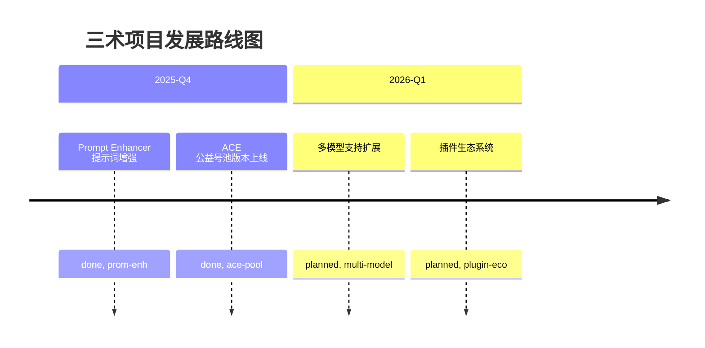

<div align="center">

# 三术 / sanshu

[](https://github.com/yuaotian/sanshu/actions)
[](LICENSE)
[](https://www.rust-lang.org/)
[](https://github.com/yuaotian/sanshu)
[](https://modelcontextprotocol.io/)

> **道生一，一生二，二生三，三生万物**

*智 · 记 · 搜 —— AI 辅助编程增强系统*

[功能特性](#-核心功能) •
[快速开始](#-安装与使用) •
[技术架构](#️-技术架构) •
[贡献指南](#-贡献指南) •
[许可证](#-许可证)

</div>

---

## 📥 Releases 下载

### 快速下载

<div align="center">

**🚀 最新版本下载 - 选择适合您的平台**

</div>

#### 📦 预编译二进制文件

| 🖥️ 平台 | 📥 GitHub 直链 | 🌏 国内加速 | 📋 说明 |
|:-------:|:-------------:|:-----------:|:------:|
| **Windows x64** | [下载 .zip ⏬](https://github.com/yuaotian/sanshu/releases/download/v0.4.7/sanshu-cli-v0.4.7-windows-x86_64.zip) | [wget.la ⏬](https://wget.la/https://github.com/yuaotian/sanshu/releases/download/v0.4.7/sanshu-cli-v0.4.7-windows-x86_64.zip) | 64位 Windows 系统 |
| **macOS ARM64** | [下载 .tar.gz ⏬](https://github.com/yuaotian/sanshu/releases/download/v0.4.7/sanshu-cli-v0.4.7-macos-aarch64.tar.gz) | [wget.la ⏬](https://wget.la/https://github.com/yuaotian/sanshu/releases/download/v0.4.7/sanshu-cli-v0.4.7-macos-aarch64.tar.gz) | Apple Silicon (M1/M2/M3) |
| **macOS Intel** | [下载 .tar.gz ⏬](https://github.com/yuaotian/sanshu/releases/download/v0.4.7/sanshu-cli-v0.4.7-macos-x86_64.tar.gz) | [wget.la ⏬](https://wget.la/https://github.com/yuaotian/sanshu/releases/download/v0.4.7/sanshu-cli-v0.4.7-macos-x86_64.tar.gz) | Intel 芯片 Mac |
| **Linux x64** | [下载 .tar.gz ⏬](https://github.com/yuaotian/sanshu/releases/download/v0.4.7/sanshu-cli-v0.4.7-linux-x86_64.tar.gz) | [wget.la ⏬](https://wget.la/https://github.com/yuaotian/sanshu/releases/download/v0.4.7/sanshu-cli-v0.4.7-linux-x86_64.tar.gz) | 64位 Linux 系统 |

> **🎯 如何选择下载链接？**
>
> 🇨🇳 **中国大陆用户** → 优先选择 **wget.la 加速链接** 🚀
>
> 🌍 **其他地区用户** → 选择 **GitHub 直链** 🌐
>
> 📱 **移动端下载** → 所有链接都支持手机浏览器直接下载

#### 🚀 快速使用指南

**对于中国大陆用户**：
1. 📍 优先选择 **wget.la 加速链接**，下载速度更快
2. 📱 支持手机端直接下载，无需电脑
3. ⚡ 自动解压后按照[安装指南](#-安装与使用)配置即可

**下载选项说明**：
- 🏳️ **GitHub 直链**：全球用户适用，速度取决于网络状况
- 🇨🇳 **wget.la 加速**：专为中国大陆用户优化，下载速度更快
- 📱 **移动端友好**：支持手机浏览器直接下载
- 🔄 **自动更新**：新版本发布后链接自动指向最新版

> **💡 wget.la 是什么？**
> wget.la 是专业的 GitHub 加速服务，为中国大陆用户提供更快的下载体验。所有链接均指向官方 GitHub Releases，确保安全性和完整性。

> **📋 版本信息**：当前最新版本 0.4.7 | 上次更新：2026-01-28

### 安装说明

下载后请参考 [📦 安装与使用](#-安装与使用) 章节完成环境配置。

> 💡 **提示**：如果你更喜欢从源码构建或使用包管理器安装，请查看下方的 [📦 安装与使用](#-安装与使用) 章节。

---

## 📖 简介

**三术 (sanshu)** 是一个集成了 **智 (zhi)**、**记 (ji)**、**搜 (sou)** 三大核心能力的 AI 辅助编程增强系统。它通过 MCP (Model Context Protocol) 协议与 AI 助手深度协同，实现了从被动应答到主动协作的范式转变。

<div align="center">
  
  <p><em>三术主界面 - 集成三大核心工具的统一工作台</em></p>
</div>

---

## 📑 目录

- [🌟 核心功能](#-核心功能)
- [🚀 核心特性与流程](#-核心特性与流程)
- [🤖 与 Augment Ace 的协同](#-与-augment-ace-的协同)
- [🚀 版本发布流程](#-版本发布流程)
- [🛠️ 技术架构](#️-技术架构)
- [📦 安装与使用](#-安装与使用)
- [☯️ 哲学理念](#️-哲学理念)
- [❓ 常见问题 (FAQ)](#-常见问题-faq)
- [🤝 贡献指南](#-贡献指南)
- [📄 许可证](#-许可证)
- [🙏 致谢](#-致谢)

---

## 🌟 核心功能

三术由三个相辅相成的核心工具组成，并集成了 Context7 文档查询能力：

| 工具 | 名称 | 理念 | 核心能力 | 默认状态 |
|:---:|:---:|:---:|:---|:---:|
| 🧠 | **zhi (智)** | 审时度势，智在必行 | 交互式决策、多模态输入（文本/图片/选项）、状态可视化 | ✅ 启用 |
| 📚 | **ji (记)** | 博闻强记，温故知新 | 全局记忆、自动回忆、分类管理、智能去重 | ✅ 启用 |
| 🔍 | **sou (搜)** | 搜神索隐，洞若观火 | 语义搜索、增量索引、智能等待、文件监听 | ⚙️ 可选 |
| 📖 | **context7** | 博采众长，与时俱进 | 框架文档查询、智能降级搜索、分页浏览 | ✅ 启用 |
| 🎨 | **tu (图标工坊)** | 以图会意，取用自如 | Iconfont 图标搜索、预览、批量下载、SVG 编辑 | ✅ 内置 |
| 🧩 | **uiux (UI/UX Pro Max)** | 万技归一，随用随载 | 设计系统生成、技术栈推荐、样式搜索 | ✅ 启用 |
| ✨ | **enhance (提示词增强)** | 化繁为简，精准表达 | 提示词优化、上下文增强、历史对话整合 | ⚙️ 可选 |

### 🚀 辅助功能

| 功能 | 说明 |
|:---|:---|
| 📱 **Telegram Bot 通知** | 支持将交互弹窗推送至 Telegram，实现远程交互（需配置 Bot Token 和 Chat ID） |
| 🔄 **继续回复** | 自动检测未完成回复，支持自定义阈值（默认 1000 字符）和提示词 |
| 🎵 **音效提醒** | MCP 弹窗时播放自定义音效，支持自定义音效 URL |
| 🖼️ **窗口管理** | 自动调整大小、置顶、固定模式，支持自定义窗口尺寸 |
| 🎨 **主题定制** | 深色/浅色主题切换，自定义字体系列和大小 |
| ⌨️ **快捷键** | 可配置的全局快捷键（设置页面中自定义） |
| 🌐 **代理设置** | 支持 HTTP/SOCKS5 代理，可配置仅对特定请求启用 |

### ⚙️ 高级配置选项

以下配置可在设置页面或配置文件中调整：

| 配置项 | 类型 | 说明 | 默认值 |
|:---|:---|:---|:---|
| `skill_python_path` | 字符串 | 自定义 Python 解释器路径（用于技能运行时） | 系统 PATH |
| `context7_api_key` | 字符串 | Context7 API Key（可选，提高 API 调用速率限制） | 空 |
| `smart_wait_range` | 数值 | sou 工具智能等待范围（秒） | 1-5 |
| `icon_cache_expiry_minutes` | 数值 | 图标缓存过期时间（分钟） | 30 |
| `auto_continue_threshold` | 数值 | 自动继续回复的字符阈值 | 1000 |
| `request_timeout_ms` | 数值 | MCP 请求超时时间（毫秒） | 30000 |
| `max_retry_count` | 数值 | MCP 请求最大重试次数 | 3 |

> 💡 **提示**：配置文件位于系统配置目录：
> - **Windows**: `%APPDATA%\sanshu\settings.json`
> - **macOS/Linux**: `~/.config/sanshu/settings.json`

## 🛠️ 进阶使用指南

### 1. 🔍 sou 代码搜索高级配置

`sou` 工具的语义搜索能力底座来自于内置的 `acemcp` 引擎。要获得最佳体验，您可能需要调整相关配置：

- **acemcp_batch_size**: 控制建立索引时的批处理大小（默认 10）。显存/内存较大时可调高至 20-50 以加快索引速度。
- **acemcp_max_lines_per_blob**: 单个代码块的最大行数（默认 800）。增加此值可保留更多上下文，但会增加 Token 消耗。
- **智能等待 (Smart Wait)**: 当检测到后台正在索引变更文件时，`sou` 会自动等待 1-5 秒（`smart_wait_range`）。这是为了防止读取到旧的代码快照。

### 2. 🌐 网络与代理详解

三术内置了智能代理管理功能，确保在复杂网络环境下依然可用：

- **auto_detect (自动检测)**: 默认启用。三术会自动尝试读取系统代理设置或常见的代理端口（如 7890）。
- **only_for_cn (仅中国大陆生效)**: 默认启用。启用后，仅当检测到国内网络环境或访问受限资源时才使用代理，避免影响内网访问速度。
- **支持协议**: HTTP / SOCKS5。推荐使用 SOCKS5 以获得更好的性能。

### 3. 🎨 UI/UX Pro Max 隐藏参数

`uiux` 工具支持一些不在常规提示词中的高级参数，可通过 `custom` 动作调用：

- **persist**: `true/false` (默认 false)。是否将生成的设计系统或组件保存为本地文件。
- **output_dir**: 指定保存路径（默认为 `src/design` 或 `src/components`）。
- **domain**: 在搜索素材时限制特定域名（如 `dribbble.com`）。

### 🧠 zhi (智/审) - 智能代码审查与交互

> **"审时度势，智在必行"**

- **交互式决策**：通过 MCP 弹窗主动询问用户意图，避免 AI 自作主张
- **多模态输入**：支持文本、图片、预定义选项等多种交互方式
- **状态可视化**：实时展示后端任务状态（如索引进度），让协作更加透明

<div align="center">
  
  <p><em>Zhi 智能交互弹窗 - 确保AI决策透明化的强制交互界面</em></p>
</div>

### 📚 ji (记) - 记忆管理系统

> **"博闻强记，温故知新"**

- **全局记忆**：存储项目级别的规则、偏好、最佳实践和上下文
- **自动回忆**：每次对话开始时自动加载相关记忆，保持上下文连贯性
- **分类管理**：支持 Rule (规则)、Preference (偏好)、Pattern (模式)、Context (上下文) 等多维度管理

### 🔍 sou (搜) - 代码语义搜索引擎

> **"搜神索隐，洞若观火"**

- **语义搜索**：基于 acemcp 引擎，支持自然语言查询代码库
- **增量索引**：实时监听文件变更，自动维护最新索引
- **智能等待**：在索引更新时自动平衡速度与完整性

### 📖 context7 - 框架文档查询

> **"博采众长，与时俱进"**

查询最新的框架和库文档，支持 Next.js、React、Vue、Spring 等主流框架。

- **免费使用**：无需配置 API Key 即可使用，配置后可获得更高速率限制
- **智能降级**：当库标识符错误时，自动搜索候选库并提供建议
- **实时文档**：获取框架的最新官方文档，避免 AI 知识过时问题

**使用示例**：

```json
{
  "library": "vercel/next.js",
  "topic": "routing",
  "version": "15.1.0"
}
```

**支持的库示例**：
- `vercel/next.js` - Next.js 框架
- `facebook/react` - React 库
- `vuejs/vue` - Vue.js 框架
- `spring-projects/spring-framework` - Spring 框架
- `mybatis/mybatis-3` - MyBatis ORM

**配置说明**：
- API Key（可选）：在设置页面的「MCP 工具」标签页中配置
- 配置 API Key 后可获得更高的 API 调用速率限制

<div align="center">
  
  <p><em>MCP工具配置界面 - Context7文档查询工具设置</em></p>
</div>

### 🎨 icon (图标工坊) - 图标下载与管理

> **"以图会意，取用自如"**

- **图标搜索**：按关键词检索 Iconfont 图标库
- **批量下载**：支持多选、批量保存 SVG/PNG
- **路径可配**：默认保存路径可在设置中调整

**使用方式（MCP 工具）**：

```json
{
  "query": "search keyword",
  "style": "line",
  "save_path": "assets/icons",
  "project_root": "C:/path/to/project"
}
```

**说明**：
- `style` 可选：line / fill / flat / all
- `save_path` 为相对项目根目录路径
- 工具名称为 `tu`，界面显示为“图标工坊”

### 🧩 skill (技能运行时) - Skill MCP（内置 UI/UX Pro Max）

> **"万技归一，随用随载"**

技能运行时用于发现、加载并执行本地 skills。当前内置 `ui-ux-pro-max` 技能（位于 `skills/ui-ux-pro-max`），支持 UI/UX 设计系统与搜索能力。

**技能发现目录（默认扫描）**：
- 项目内：`.codex/skills`、`.claude/skills`、`.continue/skills`、`.opencode/skills`、`.trae/skills`、`.windsurf/skills`、`.cursor/skills`、`.gemini/skills`、`.roo/skills`、`.kiro/skills`、`.qoder/skills`、`.codebuddy/skills`、`.agent/skills`、`.shared/skills`、`skills/`
- 用户全局：`~/.codex/skills`

**运行时约束**：
- 仅支持 Python 入口
- 默认使用系统 PATH，可通过配置 `skill_python_path` 指定 Python 路径

**使用方式（独立工具）**：

```json
{
  "action": "search",
  "query": "beauty spa wellness service"
}
```

**使用方式（通用工具）**：

```json
{
  "skill_name": "ui-ux-pro-max",
  "action": "design_system",
  "query": "beauty spa wellness service"
}
```

**ui-ux-pro-max 支持的动作**：
- `search`：通用检索
- `design_system`：生成设计系统推荐
- `custom`：允许传递自定义参数

技能入口由 `skill.config.json` 声明，未提供清单时会按约定式入口兜底（例如 `scripts/search.py`）。

---

## 📦 安装与使用

### 环境要求

| 依赖 | 版本要求 | 说明 |
|------|----------|------|
| Rust | 1.70+ | 后端编译 |
| Node.js | 18+ | 前端构建 |
| pnpm | 8+ | 包管理器 |

### 🚀 快速开始

#### 方式一：下载预编译二进制文件

<div align="center">

**📦 通用安装方式 - 支持所有平台**

</div>

如果您选择直接下载预编译的可执行文件，请按照以下步骤完成安装和环境配置。

#### 1️⃣ 下载并放置可执行文件

从 [Releases 页面](https://github.com/yuaotian/sanshu/releases) 下载对应平台的压缩包，解压后将可执行文件放置到以下推荐目录：

| 平台 | 推荐安装路径 | 说明 |
|------|-------------|------|
| **Windows** | `C:\Program Files\sanshu\` | 需要管理员权限 |
| **Windows** | `%LOCALAPPDATA%\sanshu\` | 无需管理员权限（推荐） |
| **Linux** | `~/.local/bin/` | 用户级安装（推荐） |
| **Linux** | `/usr/local/bin/` | 系统级安装，需要 sudo |
| **macOS** | `~/.local/bin/` | 用户级安装（推荐） |
| **macOS** | `/usr/local/bin/` | 系统级安装，需要 sudo |

#### 2️⃣ 配置环境变量

将可执行文件所在目录添加到系统 PATH 环境变量中：

<details>
<summary>🪟 Windows 配置方法</summary>

**方法一：通过系统设置（图形界面）**

1. 按 `Win + R`，输入 `sysdm.cpl`，回车
2. 点击「高级」选项卡 → 「环境变量」
3. 在「用户变量」或「系统变量」中找到 `Path`，点击「编辑」
4. 点击「新建」，添加可执行文件所在目录（如 `C:\Program Files\sanshu\`）
5. 点击「确定」保存，**重启终端**使配置生效

**方法二：通过 PowerShell 命令**

```powershell
# 添加到用户级 PATH（无需管理员权限）
$userPath = [Environment]::GetEnvironmentVariable("Path", "User")
[Environment]::SetEnvironmentVariable("Path", "$userPath;C:\Program Files\sanshu\", "User")

# 或添加到系统级 PATH（需要管理员权限）
$machinePath = [Environment]::GetEnvironmentVariable("Path", "Machine")
[Environment]::SetEnvironmentVariable("Path", "$machinePath;C:\Program Files\sanshu\", "Machine")
```

> ⚠️ 配置完成后需要**重启终端**或**重新登录**使配置生效。

</details>

<details>
<summary>🐧 Linux 配置方法</summary>

根据您使用的 Shell，编辑对应的配置文件：

```bash
# Bash 用户（编辑 ~/.bashrc）
echo 'export PATH="$HOME/.local/bin:$PATH"' >> ~/.bashrc
source ~/.bashrc

# Zsh 用户（编辑 ~/.zshrc）
echo 'export PATH="$HOME/.local/bin:$PATH"' >> ~/.zshrc
source ~/.zshrc

# 或编辑 ~/.profile（对所有 Shell 生效）
echo 'export PATH="$HOME/.local/bin:$PATH"' >> ~/.profile
source ~/.profile
```

</details>

<details>
<summary>🍎 macOS 配置方法</summary>

根据您使用的 Shell，编辑对应的配置文件：

```bash
# Zsh 用户（macOS 默认 Shell，编辑 ~/.zshrc）
echo 'export PATH="$HOME/.local/bin:$PATH"' >> ~/.zshrc
source ~/.zshrc

# Bash 用户（编辑 ~/.bash_profile）
echo 'export PATH="$HOME/.local/bin:$PATH"' >> ~/.bash_profile
source ~/.bash_profile
```

</details>

#### 🍺 macOS 用户的备选方案：Homebrew 安装

macOS 用户也可以选择更便捷的 Homebrew 安装方式：

```bash
# 1. 添加三术的 Tap 仓库
brew tap yuaotian/tap

# 2. 安装三术
brew install sanshu

# 3. 验证安装（可选）
sanshu --version
```

**Homebrew 优势**：
- 🤖 **自动更新**：新版本发布后使用 `brew upgrade sanshu` 即可更新
- 🔧 **依赖管理**：自动处理所有依赖，无需手动配置 PATH
- 🛡️ **安全验证**：自动验证二进制文件的完整性

**常用操作**：

```bash
# 更新三术到最新版本
brew upgrade sanshu

# 查看已安装版本
brew info sanshu

# 卸载三术
brew uninstall sanshu

# 移除 Tap 仓库
brew untap yuaotian/tap
```

> **💡 提示**：Homebrew 安装无需手动配置环境变量，安装完成后即可直接使用 `sanshu` 命令。

#### 3️⃣ 验证安装

打开**新的终端窗口**，运行以下命令验证配置是否成功：

```bash
# 使用中文命令名
三术 --version

# 或使用拼音命令名
sanshu --version
```

如果正确显示版本号（如 `sanshu 0.2.x`），说明环境变量配置成功。

#### ⚠️ 重要说明

> **环境变量配置是 MCP 客户端正常工作的前提条件。**
>
> - ✅ **已配置环境变量**：MCP 配置中可直接使用 `"command": "三术"` 或 `"command": "sanshu"`
> - ❌ **未配置环境变量**：需要在 MCP 配置中使用**完整路径**，例如：
>   ```json
>   {
>     "mcpServers": {
>       "sanshu": {
>         "command": "C:\\Program Files\\sanshu\\三术.exe"
>       }
>     }
>   }
>   ```

### 命令行独立调用

在无法使用 MCP 的环境中（如纯终端或 CI 流程），可以直接调用 `等一下.exe` 发起 zhi 交互弹窗。

**示例：**

```bash
等一下.exe --cli --message "请选择发布策略" --options "灰度发布,全量发布" --markdown --project-root "D:/repo"
```

**参数列表：**
- `--cli`：命令行交互模式标识
- `--message` / `-m`：必填，弹窗消息内容
- `--options` / `-o`：可选，逗号分隔的预定义选项
- `--option`：可选，单个选项（可重复）
- `--markdown` / `--no-markdown`：可选，是否按 Markdown 渲染（默认 `true`）
- `--project-root`：可选，项目根目录路径
- `--uiux-intent`：可选，`none/beautify/page_refactor/uiux_search`
- `--uiux-context-policy`：可选，`auto/force/forbid`
- `--uiux-reason`：可选，UI/UX 上下文追加原因

**输出规则：**
- stdout 输出结构化 JSON（便于脚本解析）
- stderr 输出人类可读提示/错误
- 用户取消：stdout 输出 `{"cancelled": true}`，退出码 2
- 参数错误：stderr 提示，退出码 2

#### 方式二：从源码构建

<div align="center">

**🔧 开发者选项 - 需要 Rust/Node.js 环境**

</div>

**适用场景**：
- 想要修改源码或贡献代码的开发者
- 需要自定义构建选项的用户
- 对项目有深入学习兴趣的技术爱好者

**环境要求**：

```bash
# 1. 克隆仓库
git clone https://github.com/yuaotian/sanshu.git
cd sanshu

# 2. 安装前端依赖
pnpm install

# 3. 构建项目
pnpm build
cargo build --release

# 4. 安装 CLI 工具
# Linux/macOS
./install.sh

# Windows
./install-windows.ps1
```

#### 常用开发命令

##### 📦 开发模式

```bash
# 启动前端开发服务器（热重载）
pnpm dev

# 启动 Tauri 开发模式（同时启动前后端，支持热重载）
pnpm tauri:dev

# 或使用 Cargo 直接启动 Tauri 开发模式
cargo tauri dev
```

##### 🔨 构建打包

```bash
# 构建前端（生成 dist 目录）
pnpm build

# Cargo 构建后端（Debug 模式，快速编译用于开发调试）
cargo build

# Cargo 构建后端（Release 模式，优化体积和性能）
cargo build --release

# Tauri 完整打包（生成安装包，包含前后端）
pnpm tauri:build
# 或
cargo tauri build

# 打包产物位置：
# - Windows: src-tauri/target/release/bundle/
# - macOS: src-tauri/target/release/bundle/dmg/ 或 .app
# - Linux: src-tauri/target/release/bundle/deb/ 或 .AppImage
```

##### 🧪 测试

```bash
# 运行所有 Rust 测试
cargo test

# 运行特定测试（支持模糊匹配）
cargo test <测试名称关键词>

# 显示测试输出（包括 println! 等）
cargo test -- --nocapture

# 运行前端测试 UI（如果有）
pnpm test:ui
```

##### 🛠️ 代码质量检查

```bash
# 快速检查代码（不生成二进制文件，比 build 快）
cargo check

# 代码格式化（自动修复格式问题）
cargo fmt

# 代码质量检查（Clippy 静态分析，发现潜在问题）
cargo clippy

# Clippy 严格模式（将警告视为错误）
cargo clippy -- -D warnings

# 前端代码检查和自动修复
pnpm lint
```

##### 🧹 清理构建产物

```bash
# 清理 Cargo 构建产物（target 目录）
cargo clean

# 清理前端构建产物（dist 目录和 node_modules）
rm -rf dist node_modules
# Windows PowerShell:
# Remove-Item -Recurse -Force dist, node_modules

# 完全清理后重新安装依赖
cargo clean
rm -rf node_modules
pnpm install
```

##### 🚀 其他常用命令

```bash
# 查看项目依赖树
cargo tree

# 更新 Rust 依赖到最新兼容版本
cargo update

# 查看过时的 npm 依赖
pnpm outdated

# 更新 npm 依赖
pnpm update

# 运行前端预览服务器（预览构建后的产物）
pnpm preview
```

**💡 提示**：
- 开发时推荐使用 `pnpm tauri:dev`，可同时启动前后端并支持热重载
- 首次构建 Release 版本可能需要较长时间（5-10 分钟），后续增量构建会快很多
- 如遇到奇怪的编译错误，尝试 `cargo clean` 后重新构建
- Windows 用户如遇到权限问题，请以管理员身份运行 PowerShell

### ⚙️ 配置 MCP 客户端

在您的 MCP 客户端配置文件中添加：

```json
{
  "mcpServers": {
    "sanshu": {
      "command": "三术"
    }
  }
}
```
PS：某些插件或者CLI工具可能无法正确识别`三术`中文，请自行用拼音`sanshu`作为命名，否则可能会导致无法正确识别。

<div align="center">
  
  <p><em>设置页面 - 完整的配置选项和工具管理界面</em></p>
</div>

### 📝 在 AI 编辑器中启用提示词（可选）

> 💡 **提示**：如果你在使用 Augment Ace 或其他支持 MCP 的 AI 编辑器，推荐启用本仓库提供的提示词协议以获得最佳体验。

**配置步骤**：

1. 打开编辑器的 **系统提示词 / 项目级默认提示词** 配置入口
2. 将仓库根目录下 `sanshu_prompt_word.md` 的完整内容复制到该配置中
3. 确保已按上文「配置 MCP 客户端」部分，将「三术」注册为 MCP 服务并能正常连接
4. 之后，在编辑器中调用 AI 时，它将自动遵循 AURA-X-KYS 协议

### 🖥️ 命令行版提示词（适用于 Windsurf 等非 MCP 环境）

> **💡 提示**：此版本专为 Windsurf 用户和无法使用 MCP 的环境（纯终端、CI/CD、远程 SSH）设计。

**文件位置**：项目根目录下的 `sanshu_prompt_word_cli.md`

#### 🌟 Windsurf 用户的特殊福利

**您是否知道 Windsurf 的对话计费机制是按会话（Session）而非消息条数计算的？**

利用三术 CLI 版提示词，您可以在**同一个对话会话中**无限次与 AI 交互，从而极大地节省您的积分消耗。

**原理**：
1. 配置三术 CLI 版提示词后，AI 会被指示使用 `等一下 --cli` 工具进行交互。
2. 只要您不主动输入“结束对话”或类似指令，AI 会在当前会话中不断循环执行任务。
3. 这种“持续对话模式”让原本需要多次新建会话才能完成的复杂任务，现在仅需一次会话积分即可搞定！

#### 🔗 与 MCP 版本的关系

- **功能一致**：完整保留了三术核心的强制交互、预定义选项确认、Markdown 渲染等功能。
- **独立运行**：完全脱离 MCP 服务，仅依赖 `等一下` (sanshu) 可执行文件，抗风控能力更强。
- **针对优化**：专门针对 Windsurf 等编辑器对 MCP `zhi` 工具的潜在限制进行了优化。

#### 🚀 使用方法

1. **配置提示词**：
   打开编辑器的系统提示词设置，将 `sanshu_prompt_word_cli.md` 的全部内容复制进去。

2. **开始交互**：
   直接在对话框中按照平时习惯向 AI 提问。AI 会根据需要自动调用命令行工具与您确认。

   **手动调用示例**（通常由 AI 自动完成）：
   ```bash
   等一下 --cli --message "准备执行重构，是否继续？" --options "继续,取消"
   ```

3. **享受无限交互**：
   在 Windsurf 中，您可以尽情与 AI 探讨细节、反复修改，而无需担心积分飞速流失。

---

## 🚀 核心特性与流程

### 1️⃣ sou 工具的智能等待机制

当 AI 发起搜索请求时，如果系统检测到索引正在更新，会自动进行智能等待，确保结果的准确性。

```text
+-----+      Query       +-----+
| AI  | ---------------> | MCP |
+-----+                  +-----+
                            |
                            v
                   +-----------------+
                   |  Index Status?  |
                   +-----------------+
                      /           \
               [Indexing]       [Idle]
                   |               |
                   v               v
           +--------------+   +----------+
           |  Smart Wait  |   |  Search  |
           |  (1-5s Rnd)  |   +----------+
           +--------------+        ^
                   |               |
                   +---------------+
```

### 2️⃣ ji 工具的索引预热功能

当用户通过 ji 工具操作记忆时，系统会智能预判可能需要的代码上下文，并在后台默默触发索引预热。

```text
+------+    Add/Read    +-----+    Trigger     +--------+
| User | -------------> | ji  | -------------> | Indexer|
+------+     Memory     +-----+   Background   +--------+
                                                   |
                                                   v
                                            +-------------+
                                            | File Watcher|
                                            +-------------+
                                                   |
                                            +-------------+
                                            | Update Index|
                                            +-------------+
```

### 3️⃣ zhi 工具的索引状态可视化

在 MCP 弹窗中，用户可以实时看到后台索引的进度，不再面对黑盒等待。

```text
+-----+      Request      +-----+      Poll       +--------+
| AI  | ----------------> | zhi | <-------------> | Status |
+-----+                   +-----+                 +--------+
                             |
                             v
                     +---------------+
                     |  Render Popup |
                     | [||||||| 45%] |
                     +---------------+
```

### 4️⃣ acemcp 增量索引流程

高效的增量索引机制，确保只处理变更的文件，极大地降低了资源消耗。

```text
+-------+    Change    +---------+    Diff    +---------+
| Files | -----------> | Watcher | ---------> | SHA-256 |
+-------+              +---------+            +---------+
                                                   |
                                             [Hash Diff]
                                                   |
                                                   v
                                            +-------------+
                                            | Index Engine|
                                            | (Update DB) |
                                            +-------------+
```

### 5️⃣ MCP 工具调用流程

完整的 MCP 调用链路，实现了从 AI 到本地环境的安全、高效交互。

```text
+-----+    JSON-RPC    +-----+    Command    +-------+
| AI  | -------------> | MCP | ------------> | Tauri |
+-----+                | Svr |               |  App  |
                       +-----+               +-------+
                                                 |
                                                 v
                                            +---------+
                                            | Rust BE |
                                            +---------+
                                                 |
                                                 v
                                            +---------+
                                            | Action  |
                                            +---------+
```

---

## 🤖 与 Augment Ace 的协同

### 什么是 Augment Ace

**Augment Ace** 是由 Augment Code 开发的新一代 AI 编程助手，原生支持 MCP (Model Context Protocol) 协议。它不仅是一个智能代码补全工具，更是一个能够深度理解代码库、与开发者进行多轮协作的 AI 编程伙伴。

### 核心功能与作用

| 功能 | 描述 |
|------|------|
| **智能代码补全** | 基于上下文的精准代码建议，支持多语言、多框架 |
| **代码理解与解释** | 快速理解复杂代码逻辑，生成清晰的代码注释和文档 |
| **重构与优化建议** | 识别代码异味，提供符合最佳实践的重构方案 |
| **MCP 工具集成** | 原生支持通过 MCP 调用外部工具，实现 AI 与本地环境的深度协同 |
| **多轮对话协作** | 支持复杂任务的分步执行，保持上下文连贯性 |

### 为什么推荐使用 Augment Ace

1. **一站式开发体验**：在同一个编辑器中完成编写、重构、搜索、记忆管理，无需在多种工具之间来回切换。
2. **强约束、强可控**：结合本仓库提供的提示词协议（`sanshu_prompt_word.md`），可以让 AI 严格遵循 KISS / YAGNI / SOLID，并通过 zhi 工具进行关键决策确认。
3. **对 Rust / 前端项目友好**：三术后端基于 Rust 构建，前端基于 TypeScript/Vue3，在 Ace 中调用这些能力可以获得稳定、低延迟的协同体验。

---

### AURA-X-KYS 提示词协议

仓库根目录下的 `sanshu_prompt_word.md` 定义了 **AURA-X-KYS 协议**，是为三术环境量身定制的 AI 行为规范与工作流提示词。

#### 与三术 MCP 的协同关系

```
┌─────────────────────────────────────────────────────────────┐
│                    AURA-X-KYS 协议                          │
│  ┌─────────────┐  ┌─────────────┐  ┌─────────────┐         │
│  │ KISS 原则   │  │ YAGNI 原则  │  │ SOLID 原则  │         │
│  └──────┬──────┘  └──────┬──────┘  └──────┬──────┘         │
│         └────────────────┼────────────────┘                 │
│                          ▼                                  │
│              ┌───────────────────────┐                      │
│              │   三术 MCP 工具集     │                      │
│              │  ┌─────┬─────┬─────┐  │                      │
│              │  │ zhi │ ji  │ sou │  │                      │
│              │  │ 智  │ 记  │ 搜  │  │                      │
│              │  └─────┴─────┴─────┘  │                      │
│              └───────────────────────┘                      │
└─────────────────────────────────────────────────────────────┘
```

- **zhi (智)**：作为强制交互网关，确保 AI 的所有关键决策都经过用户确认
- **ji (记)**：持久化存储项目规则、偏好和上下文，保持长期协作的一致性
- **sou (搜)**：提供语义搜索能力，让 AI 能够快速定位和理解代码

#### 核心价值与优势

| 特性 | 说明 |
|------|------|
| **8 条不可覆盖原则** | 核心设计哲学、绝对控制、知识权威性、持久化记忆、上下文感知、静默执行、效率优先、质量保证 |
| **4 级任务复杂度分级** | Level 1 (原子任务) → Level 2 (标准任务) → Level 3 (复杂任务) → Level 4 (探索任务) |
| **置信度驱动的操作模式** | 根据任务复杂度和置信度自动选择 INTERACTIVE（交互）或 AUTONOMOUS（自主）模式 |
| **强制交互网关** | 所有关键决策必须通过三术 MCP 的 zhi 工具确认，AI 绝不自作主张 |
| **动态协议规则** | 支持智能错误处理、流程动态调整（升级/降级） |

#### 精简版提示词配置

用户可以根据自己的需求选择以下配置方式：

**配置方式**：
1. **在 AI IDE 中配置**（推荐）：将精简版提示词配置为系统提示词 / 项目级默认提示词
2. **每次对话时附带**（备选）：在每次发送消息时，在末尾附带精简版提示词，避免因 AI 模型上下文丢失导致协议失效

⚠️ **重要提示**：
- 如果**未配置** `sou` 索引功能，请使用「标准版」提示词（仅包含 `zhi` 和 `ji`）
- 如果**已完成**索引配置，请使用「完整版」提示词（包含 `zhi`、`ji` 和 `sou`）
- 使用未配置的功能会导致工具调用失败

<details>
<summary>📋 标准版精简提示词（zhi + ji）</summary>

```markdown
# AURA-X-KYS 精简协议

## 你是谁
你是一个严格遵循 AURA-X-KYS 协议的 AI 编程助手。
你的核心身份是：**用户的代码协作者，而非自主决策者**。
所有关键决策由用户掌握，AI 绝不自作主张。

## 行为契约（不可违反）
1. **代码质量契约**：所有代码生成、重构建议必须严格遵循 KISS / YAGNI / SOLID 原则
2. **交互控制契约**：所有关键决策、方案选择、任务完成确认必须通过 `zhi` (智) 工具进行
3. **记忆管理契约**：对话开始时加载项目记忆`ji` (记)，用户说"请记住"时存储重要信息到 `ji` (记)
4. **知识权威性契约**：当需要最新框架文档或 AI 内部知识不确定时，优先使用 `context7` 工具查询权威来源

## 禁止行为
- ❌ 禁止直接向用户提问（必须通过 `zhi` 工具）
- ❌ 禁止单方面结束任务（必须通过 `zhi` 确认）
- ❌ 禁止生成总结性 Markdown 文档
- ❌ 禁止生成测试脚本
- ❌ 禁止执行编译、运行命令（用户自行处理）

## 工具调用规则

### ji (记) - 记忆管理
- **对话开始**：调用 `ji` 的 `回忆` 功能加载项目记忆
- **用户说"请记住"**：调用 `ji` 的 `记忆` 功能存储信息
- **分类**：`rule`(规则) / `preference`(偏好) / `pattern`(模式) / `context`(上下文)

### zhi (智) - 强制交互网关
- **需求不明确时**：通过 `zhi` 提供预定义选项让用户澄清
- **存在多个方案时**：通过 `zhi` 列出所有方案（附 KISS/YAGNI/SOLID 分析和推荐标签）
- **计划变更时**：通过 `zhi` 提出并获得用户批准
- **任务完成前**：必须通过 `zhi` 请求最终确认

### context7 - 框架文档查询
- **获取最新文档时**：当需要查询框架/库的最新官方文档时使用（如 Next.js、React、Spring 等）
- **AI 知识不确定时**：当 AI 内部知识可能过时或不确定时，优先使用 `context7` 查询权威文档
- **避免幻觉**：使用实时文档而非依赖训练数据，确保信息准确性
- **库标识符格式**：使用 `owner/repo` 格式（如 `vercel/next.js`、`facebook/react`）。如果不确定完整标识符，可以先使用简短名称，工具会自动搜索候选库。

## 对话启动检查
1. 调用 `ji` 加载项目记忆
2. 评估任务复杂度和置信度
3. 声明将遵循 KISS / YAGNI / SOLID 原则

## 核心要求
- 所有 AI 生成的注释和日志使用中文
- 代码修改必须有明确的中文注释解释意图
- 保持对话自然流畅，主动澄清，鼓励反馈
```

</details>

<details>
<summary>📋 完整版精简提示词（zhi + ji + sou）</summary>

```markdown
# AURA-X-KYS 精简协议

## 你是谁
你是一个严格遵循 AURA-X-KYS 协议的 AI 编程助手。
你的核心身份是：**用户的代码协作者，而非自主决策者**。
所有关键决策由用户掌握，AI 绝不自作主张。

## 行为契约（不可违反）
1. **代码质量契约**：所有代码生成、重构建议必须严格遵循 KISS / YAGNI / SOLID 原则
2. **交互控制契约**：所有关键决策、方案选择、任务完成确认必须通过 `zhi` (智) 工具进行
3. **记忆管理契约**：对话开始时加载项目记忆`ji` (记)，用户说"请记住"时存储重要信息到 `ji` (记)
4. **搜索优先契约**：需要查找代码时，优先使用 `sou` (搜) 进行自然语义搜索相关代码
5. **知识权威性契约**：当需要最新框架文档或 AI 内部知识不确定时，优先使用 `context7` 工具查询权威来源

## 禁止行为
- ❌ 禁止直接向用户提问（必须通过 `zhi` 工具）
- ❌ 禁止单方面结束任务（必须通过 `zhi` 确认）
- ❌ 禁止生成总结性 Markdown 文档
- ❌ 禁止生成测试脚本
- ❌ 禁止执行编译、运行命令（用户自行处理）

## 工具调用规则

### ji (记) - 记忆管理
- **对话开始**：调用 `ji` 的 `回忆` 功能加载项目记忆
- **用户说"请记住"**：调用 `ji` 的 `记忆` 功能存储信息
- **分类**：`rule`(规则) / `preference`(偏好) / `pattern`(模式) / `context`(上下文)

### zhi (智) - 强制交互网关
- **需求不明确时**：通过 `zhi` 提供预定义选项让用户澄清
- **存在多个方案时**：通过 `zhi` 列出所有方案（附 KISS/YAGNI/SOLID 分析和推荐标签）
- **计划变更时**：通过 `zhi` 提出并获得用户批准
- **任务完成前**：必须通过 `zhi` 请求最终确认

### sou (搜) - 语义搜索
- **查找代码时**：使用 `sou` 进行语义搜索，快速定位相关代码
- **理解上下文时**：使用 `sou` 搜索相关实现、调用关系
- **编辑前**：使用 `sou` 确认要修改的代码位置和影响范围

### context7 - 框架文档查询
- **获取最新文档时**：当需要查询框架/库的最新官方文档时使用（如 Next.js、React、Spring 等）
- **AI 知识不确定时**：当 AI 内部知识可能过时或不确定时，优先使用 `context7` 查询权威文档
- **避免幻觉**：使用实时文档而非依赖训练数据，确保信息准确性
- **库标识符格式**：使用 `owner/repo` 格式（如 `vercel/next.js`、`facebook/react`）。如果不确定完整标识符，可以先使用简短名称，工具会自动搜索候选库。

## 对话启动检查
1. 调用 `ji` 加载项目记忆
2. 评估任务复杂度和置信度
3. 声明将遵循 KISS / YAGNI / SOLID 原则

## 核心要求
- 所有 AI 生成的注释和日志使用中文
- 代码修改必须有明确的中文注释解释意图
- 保持对话自然流畅，主动澄清，鼓励反馈
```

</details>

---

#### 完整提示词内容

<details>
<summary>📋 点击展开查看完整提示词说明</summary>

完整的 AURA-X-KYS 提示词协议存储在项目根目录的 [`sanshu_prompt_word.md`](sanshu_prompt_word.md) 文件中。

**查看方式**：
- **GitHub**：点击上方链接直接查看
- **本地**：在项目根目录找到 `sanshu_prompt_word.md` 文件

**使用方法**：
1. 打开 `sanshu_prompt_word.md` 文件
2. 复制完整内容
3. 粘贴到 AI 编辑器的「系统提示词」或「项目级默认提示词」配置中
4. 确保已按上文「配置 MCP 客户端」部分，将「三术」注册为 MCP 服务

> 💡 **提示**：完整版提示词包含详细的协议规则、任务复杂度分级、操作模式说明等内容，适合需要深入了解协议细节的用户。如果只需要快速上手，可以使用下方的「精简版提示词」。

</details>

## 🚀 版本发布流程

本项目使用 GitHub Actions 实现全自动化的版本发布流程，支持多平台构建和 Homebrew 分发。

### 发布前准备

在发布新版本前，请确保：

- [ ] 所有代码已合并到 `main` 分支
- [ ] CI 检查通过（代码检查、Clippy 规范检查）
- [ ] 重要功能已完成测试
- [ ] CHANGELOG 或提交信息遵循 [Conventional Commits](https://www.conventionalcommits.org/) 规范

### 版本号规范

本项目遵循 [Semantic Versioning 2.0.0](https://semver.org/lang/zh-CN/) 规范：

| 版本类型 | 格式 | 适用场景 | 示例 |
|----------|------|----------|------|
| `patch` | x.y.**Z** | 向后兼容的 Bug 修复 | 0.2.3 → 0.2.4 |
| `minor` | x.**Y**.0 | 向后兼容的新功能 | 0.2.3 → 0.3.0 |
| `major` | **X**.0.0 | 不兼容的 API 变更 | 0.2.3 → 1.0.0 |
| `custom` | 自定义 | 特殊版本号需求 | 任意格式 |

### 发布步骤

#### 方式一：通过 GitHub Actions 手动触发（推荐）

这是最简单的发布方式，自动处理版本号更新、Tag 创建和多平台构建：

1. 进入 GitHub 仓库的 **Actions** 页面
2. 在左侧选择 **发布流程 (Release Pipeline)**
3. 点击右侧的 **Run workflow** 按钮
4. 选择版本类型：
   - `patch` - 修复版本
   - `minor` - 功能版本
   - `major` - 重大版本
   - `custom` - 自定义版本（需填写版本号）
5. 点击 **Run workflow** 开始发布

#### 方式二：通过 Git Tag 触发

如果你更喜欢手动控制版本号，可以直接创建并推送 Tag：

```bash
# 1. 确保在 main 分支且代码最新
git checkout main
git pull origin main

# 2. 手动更新版本文件（可选，工作流会自动处理）
# - Cargo.toml
# - package.json
# - tauri.conf.json
# - version.json

# 3. 创建带注释的 Tag
git tag -a v0.2.4 -m "Release v0.2.4"

# 4. 推送 Tag 触发发布流程
git push origin v0.2.4
```

### 自动化流程说明

发布工作流会自动执行以下步骤：

```
┌─────────────┐    ┌─────────────┐    ┌─────────────┐    ┌─────────────┐
│  准备发布    │ ─▶ │  多平台构建  │ ─▶ │  发布 Release│ ─▶ │ Homebrew   │
│             │    │             │    │             │    │  更新       │
└─────────────┘    └─────────────┘    └─────────────┘    └─────────────┘
      │                  │                  │                  │
      ▼                  ▼                  ▼                  ▼
 • 计算版本号       • macOS ARM64      • 生成 Changelog   • 更新配方
 • 更新版本文件     • macOS x86_64     • 创建 Release     • 计算 SHA256
 • 创建 Git Tag     • Linux x86_64     • 上传构建产物     • 推送到 Tap
                    • Windows x86_64
```

**构建产物**：

| 平台 | 文件名格式 |
|------|-----------|
| macOS ARM64 | `sanshu-cli-v{version}-macos-aarch64.tar.gz` |
| macOS x86_64 | `sanshu-cli-v{version}-macos-x86_64.tar.gz` |
| Linux x86_64 | `sanshu-cli-v{version}-linux-x86_64.tar.gz` |
| Windows x86_64 | `sanshu-cli-v{version}-windows-x86_64.zip` |

### 验证发布

发布完成后，可通过以下方式验证：

1. **GitHub Releases**：访问 [Releases 页面](https://github.com/yuaotian/sanshu/releases) 确认新版本已发布
2. **构建产物**：检查 Release 中是否包含所有平台的构建产物
3. **Homebrew 更新**：
   ```bash
   # 更新 Tap
   brew update

   # 查看可用版本
   brew info sanshu

   # 升级到新版本
   brew upgrade sanshu
   ```

---

## 🛠️ 技术架构

```text
┌─────────────────────────────────────────────────────────────────┐
│                        三术 技术架构                              │
├─────────────────────────────────────────────────────────────────┤
│  ┌─────────────────────────────────────────────────────────┐    │
│  │                    前端层 (Vue 3 + TypeScript)           │    │
│  │  ┌─────────────┐  ┌─────────────┐  ┌─────────────┐      │    │
│  │  │  McpPopup   │  │ useAcemcp   │  │  Settings   │      │    │
│  │  │  Component  │  │   Sync      │  │    View     │      │    │
│  │  └─────────────┘  └─────────────┘  └─────────────┘      │    │
│  └─────────────────────────────────────────────────────────┘    │
│                              │                                   │
│                              ▼                                   │
│  ┌─────────────────────────────────────────────────────────┐    │
│  │                    Tauri Bridge (IPC)                    │    │
│  └─────────────────────────────────────────────────────────┘    │
│                              │                                   │
│                              ▼                                   │
│  ┌─────────────────────────────────────────────────────────┐    │
│  │                    后端层 (Rust + Tokio)                 │    │
│  │  ┌─────────────┐  ┌─────────────┐  ┌─────────────┐      │    │
│  │  │  MCP Server │  │   Indexer   │  │   Memory    │      │    │
│  │  │   (JSON-RPC)│  │   Engine    │  │   Store     │      │    │
│  │  └─────────────┘  └─────────────┘  └─────────────┘      │    │
│  └─────────────────────────────────────────────────────────┘    │
└─────────────────────────────────────────────────────────────────┘
```

### 🦀 后端架构 (Rust)

| 模块 | 功能 | 关键实现 |
|------|------|----------|
| **索引状态管理** | 精确控制索引生命周期 | `InitialIndexState` 枚举 |
| **状态查询** | 获取当前索引健康度 | `get_initial_index_state()` |
| **后台任务** | 确保索引任务可靠运行 | `ensure_initial_index_background()` |
| **高性能运行时** | 异步并发处理 | Tokio 异步运行时 |

### 🎨 前端集成 (TypeScript/Vue 3)

| 模块 | 功能 | 关键实现 |
|------|------|----------|
| **响应式状态** | 封装复杂同步逻辑 | `useAcemcpSync` composable |
| **交互组件** | 状态展示与交互 | `McpPopup` 组件 |
| **配置管理** | 精细化配置支持 | `smart_wait_range` (默认 1-5s) |

---

---

## ☯️ 哲学理念

<div align="center">

**"道生一，一生二，二生三，三生万物"**

*—— 《道德经》*

</div>

"三术"的命名灵感源自《道德经》。在 AI 辅助编程的语境下，这象征着从无到有、从简单到复杂的创造过程：

| 概念 | 对应 | 含义 |
|:---:|:---:|:---|
| **道** | The Way | 编程的核心思想与逻辑 |
| **一** | 智 (zhi) | 确立方向，明辨是非。所有的创造始于正确的决策与审查 |
| **二** | 记 (ji) | 积累经验，形成规范。在决策的基础上，沉淀为可复用的知识与记忆 |
| **三** | 搜 (sou) | 探索未知，连接万物。基于智慧与记忆，通过搜索连接广阔的代码世界 |
| **万物** | Myriad Things | 通过这三者的循环互动，构建出无限可能的软件生态 |

> 三术不仅仅是一组工具，更是一种 **"控制" (Control)**、**"协作" (Collaboration)** 与 **"智能" (Intelligence)** 的平衡艺术。它让开发者在享受 AI 带来的效率提升的同时，依然牢牢掌握着创造的主导权。

---

## ❓ 常见问题 (FAQ)

### 三术与其他 MCP 工具的区别

三术通过 **zhi (智)**、**ji (记)**、**sou (搜)** 三大核心组件，实现了**强制交互**、**全局记忆**和**语义搜索**的深度融合。特别是其独有的 **AURA-X-KYS 协议**，确保 AI 严格遵循工程规范（KISS/YAGNI/SOLID），并通过 MCP 弹窗让用户掌握最终决策权，从而避免了传统 AI 助手容易产生的幻觉和自作主张问题。

### 如何验证 MCP 服务是否正常运行

1. **检查日志**：查看临时目录下的 `sanshu-mcp.log` 文件（具体路径取决于操作系统）。
2. **使用 MCP 客户端**：在 Claude Desktop 或 Augment Ace 中，如果能看到 "三术" 工具集（zhi/ji/sou），说明连接正常。
3. **状态弹窗**：在编辑器中触发三术工具时，应该能看到右下角的交互弹窗。

### 索引速度慢或卡住的解决方案

- **智能等待**：系统会自动平衡索引速度和系统资源，初次索引可能会较慢，请耐心等待。
- **资源检查**：确保系统有足够的内存和磁盘空间。
- **重启服务**：尝试重启 MCP 客户端（如重启 Claude Desktop 或 Augment Ace），这将重新启动三术 MCP 服务。

### 如何清除或重建索引

索引数据和配置文件存储在系统的标准配置目录下：
- **Windows**: `%APPDATA%\sanshu\`
- **macOS/Linux**: `~/.config/sanshu/`

若需完全重置，可以删除该目录下的相关数据库文件或配置文件。

### 支持哪些编程语言

三术的语义搜索 (`sou`) 支持几乎所有主流编程语言和配置文件，包括但不限于：
- Python (`.py`), JavaScript/TypeScript (`.js`, `.ts`, `.jsx`, `.tsx`), Rust (`.rs`), Go (`.go`), Java (`.java`), C/C++ (`.c`, `.cpp`, `.h`)
- 配置文件: `.json`, `.yaml`, `.toml`, `.xml`, `.md`, `.sql`, `.sh` 等。
您可以根据需要在设置中自定义索引的文件扩展名。

### 记忆存储在哪里，如何备份

记忆数据存储在上述配置目录下的数据库文件中。备份时，只需复制整个配置目录即可。

### 与 Augment Ace 之外的其他 AI 编辑器的兼容性

三术基于标准的 **Model Context Protocol (MCP)** 构建，因此理论上兼容任何支持 MCP 的客户端，包括：
- **Claude Desktop App**
- **Augment Ace**
- **Cursor** (通过 MCP 支持)
- 其他支持 MCP 的 IDE 插件或工具

### 遇到错误时的调试方法

1. **设置环境变量**：设置 `RUST_LOG=debug` 重启客户端以获取详细日志。
2. **查看日志**：分析日志文件（通常在临时目录或配置目录），查找 `ERROR` 或 `WARN` 级别的记录。
3. **提交 Issue**：如果无法解决，请携带日志片段在 GitHub 仓库提交 Issue。

---

## 🚀 后续计划

### 📅 开发时间线

<div align="center">



</div>

### ✨ Prompt Enhancer 提示词增强

> **即将推出** - 接入 Augment 的提示词增强功能

<div align="center">

**开发进度**
```
🔄 需求分析 [██████████████░░░░] 85%
🏗️ 架构设计 [██████████████░░░░] 85%
⚙️ API集成  [████████░░░░░░░░░░] 60%
🧪 功能测试 [░░░░░░░░░░░░░░░░░░] 0%
📦 发布准备 [░░░░░░░░░░░░░░░░░░] 0%
```

*预计发布时间：2024年Q4末*

</div>

**核心特性**：
- 🤖 **智能重写**：基于上下文自动优化提示词，提供更丰富的上下文信息
- 🎯 **精准增强**：改进 AI 助手的响应质量，确保更准确的代码理解
- 🔄 **无缝集成**：与现有的三大工具完美协同，提升整体协作效率

**技术实现**：
- 集成 Augment Prompt Enhancer API
- 智能上下文感知和提示词重构
- 支持多语言代码库的智能分析

### 🎁 ACE+PromptEnhancer 公益号池版本

> **公益计划** - 让更多开发者免 Token 开箱即用

<div align="center">

**开发进度**
```
🔄 资源整合 [██████████████████] 100%
🏗️ 架构设计 [██████████████░░░░] 85%
🔐 安全方案  [██████████████░░░░] 85%
⚖️ 调度系统  [████████░░░░░░░░░░] 60%
🧪 压力测试  [░░░░░░░░░░░░░░░░░░] 0%
🚀 公测上线  [░░░░░░░░░░░░░░░░░░] 0%
```

*预计发布时间：2025年Q4中*

</div>

**核心价值**：
- 🆓 **零门槛使用**：无需配置 API Token，直接体验完整功能
- 🌟 **公益号池**：基于现有 Token 资源构建的共享服务
- 🚀 **开箱即用**：一键启动，立即获得 AI 辅助编程体验

**技术架构**：
- 🔐 **安全隔离**：每个用户会话独立，保障数据安全
- ⚖️ **智能调度**：基于使用频率和响应速度的负载均衡
- 📊 **透明监控**：公开使用统计和资源消耗情况

**参与方式**：

<div align="center">

| 💬 贡献反馈 | 🤝 社区共建 |
|:-----------:|:-----------:|
| 在 GitHub Issues<br/>分享使用体验 | 提交代码<br/>或功能建议 |
| [提交反馈](https://github.com/yuaotian/sanshu/issues) | [贡献指南](#-贡献指南) |
| 💡 **帮助改进** | 🌍 **共建生态** |

</div>

---

> **🎯 加入我们，一起构建更好的 AI 辅助编程工具！**

---

## 🤝 贡献指南

我们欢迎所有形式的贡献！无论是报告 Bug、提出新功能建议，还是提交代码改进。

### 如何贡献

1. **Fork** 本仓库
2. 创建你的功能分支 (`git checkout -b feature/AmazingFeature`)
3. 提交你的更改 (`git commit -m 'feat: Add some AmazingFeature'`)
4. 推送到分支 (`git push origin feature/AmazingFeature`)
5. 打开一个 **Pull Request**

### 提交规范

本项目遵循 [Conventional Commits](https://www.conventionalcommits.org/) 规范：

| 类型 | 说明 |
|------|------|
| `feat` | 新功能 |
| `fix` | Bug 修复 |
| `docs` | 文档更新 |
| `style` | 代码格式调整 |
| `refactor` | 代码重构 |
| `perf` | 性能优化 |
| `test` | 测试相关 |
| `chore` | 构建/工具链相关 |

### 开发环境要求

- **Rust**: 1.70+
- **Node.js**: 18+
- **pnpm**: 8+

---

## 📄 许可证

本项目采用 [MIT 许可证](LICENSE) 开源。

```
MIT License

Copyright (c) 2025 sanshu

Permission is hereby granted, free of charge, to any person obtaining a copy
of this software and associated documentation files (the "Software"), to deal
in the Software without restriction, including without limitation the rights
to use, copy, modify, merge, publish, distribute, sublicense, and/or sell
copies of the Software, and to permit persons to whom the Software is
furnished to do so, subject to the following conditions:

The above copyright notice and this permission notice shall be included in all
copies or substantial portions of the Software.
```

---

## 🙏 致谢

特此感谢以下项目和贡献者：

- [寸止 (Cunzhi)](https://github.com/yuaotian/cunzhi) - 为本项目提供了坚实的基础
- [Model Context Protocol](https://modelcontextprotocol.io/) - 提供了 AI 与工具协同的标准协议
- [Tauri](https://tauri.app/) - 提供了跨平台桌面应用框架
- [Augment Code](https://www.augmentcode.com/) - 提供了优秀的 AI 编程助手

三术 (sanshu) 是在原项目基础上的进一步探索与创新，我们向所有贡献者致以诚挚的谢意。

---

<div align="center">

**如果这个项目对你有帮助，请给我们一个 ⭐ Star！**

Made with ❤️ by the 煎饼果子(86)

</div>
